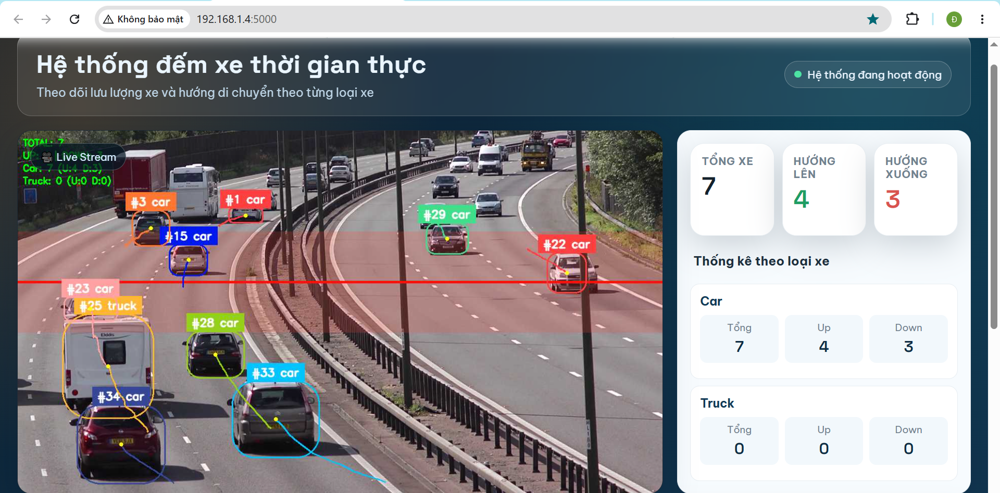
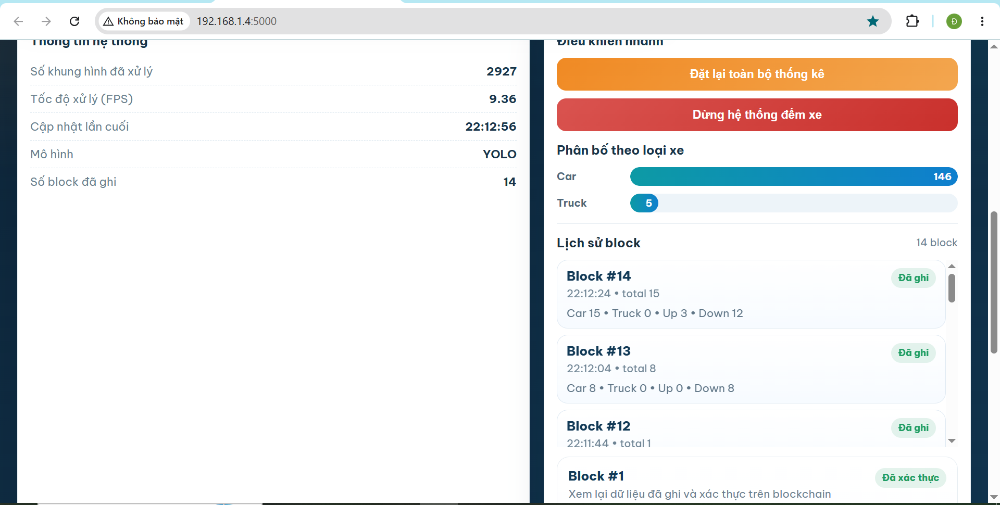
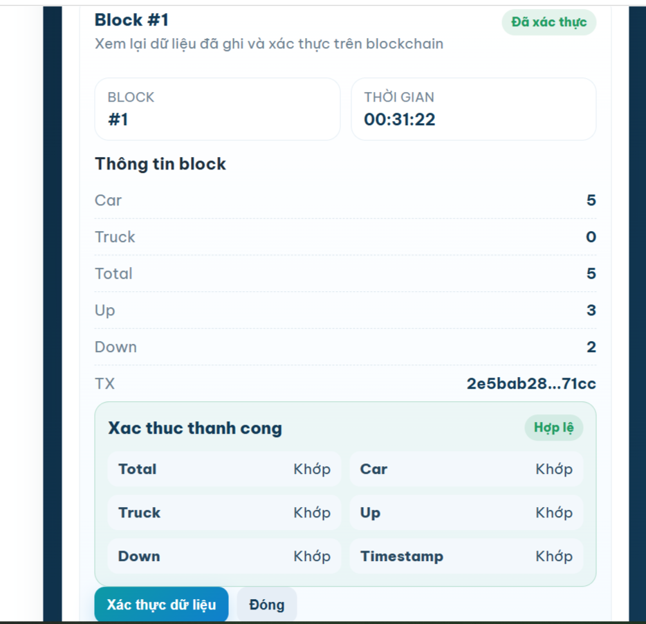

<h1 align="center">HỆ THỐNG GIÁM SÁT PHÂN LOẠI VÀ ĐẾM SỐ LƯỢNG XE</h1>

<p align="center">
  
  
</p>

<div align="center">

[](https://www.facebook.com/DNUAIoTLab)
[](https://fitdnu.net/)
[](https://dainam.edu.vn)

</div>

## 1. 🌟 Giới thiệu

Hệ thống đếm xe thời gian thực kết hợp Blockchain là một dự án tích hợp giữa **Trí tuệ nhân tạo (AI)**, **Thị giác máy tính (Computer Vision)** và **Blockchain** nhằm xây dựng một hệ thống giám sát giao thông minh bạch và an toàn.

Hệ thống sử dụng mô hình YOLOv11n để phát hiện phương tiện, kết hợp với **ByteTrack** để theo dõi quỹ đạo di chuyển và đếm số lượng xe theo thời gian thực. Dữ liệu thống kê sẽ được gửi định kỳ lên **Blockchain thông qua Smart Contract** để đảm bảo tính toàn vẹn và chống chỉnh sửa dữ liệu.

Toàn bộ hệ thống được xây dựng bằng **Python + Flask**, cung cấp Dashboard trực quan giúp người dùng giám sát video realtime, thống kê phương tiện và xác thực dữ liệu blockchain trực tiếp trên Web.

## 2. 🚀 Chức năng chính

1. **Nhận diện phương tiện:** Phát hiện xe bằng mô hình YOLOv11n.
2. **Theo dõi đối tượng:** Tracking phương tiện bằng ByteTrack.
3. **Đếm xe thời gian thực:** Đếm số lượng xe theo hướng Up/Down.
4. **Phân loại phương tiện:** Hỗ trợ Car và Truck.
5. **Streaming video realtime:** Hiển thị video trực tiếp trên Dashboard.
6. **Lưu trữ Blockchain:** Gửi snapshot dữ liệu định kỳ lên Smart Contract.
7. **Xác thực dữ liệu:** So sánh dữ liệu local với dữ liệu Blockchain.
8. **Hiển thị TX Hash:** Theo dõi giao dịch Blockchain trực tiếp.

---

## 3. 🚀 Hướng dẫn cài đặt và chạy hệ thống

### 1️⃣ Cài đặt project
    1. git clone https://github.com/vuhaiduc/He_thong_giam_sat_phan_loai_va_dem_so_luong_xe/edit/main/README.md
    2. cd realtime-vehicle-counting-blockchain

### 2️⃣ Cài đặt thư viện Python
Cài đặt Python 3 nếu chưa có, sau đó cài đặt các thư viện cần thiết:
```bash
pip install flask flask-cors ultralytics supervision opencv-python numpy torch web3
```

### 3️⃣ Cấu hình BlockChain
#### **📌 Cập nhật thông tin trong BlockChain_test.py**
```bash   
    RPC_URL = "YOUR_RPC_URL" 
    PRIVATE_KEY = "YOUR_PRIVATE_KEY" 
    CONTRACT_ADDRESS = "YOUR_CONTRACT_ADDRESS"
```
Có thể sử dụng:
  - Infura
  - Alchemy
  - Ganache Local Blockchain

## 4. 🛠️ CÔNG NGHỆ SỬ DỤNG

<div align="center">

### 🤖 AI & Computer Vision


[]()


### ⛓️ Blockchain
[]()
[]()


</div>

## 5. 🛠️ Yêu cầu hệ thống

### 💻 Phần cứng
- **CPU Intel Core i5** trở lên.
- **RAM** tối thiểu 8GB.

### 📦 Các thư viện Python cần thiết
Cài đặt các thư viện bằng lệnh:

    pip install flask, 
    pip install flask-cors,
    pip install ultralytics,
    pip install supervision,
    pip install web3,
    pip install opencv-python,
    pip install numpy,
    pip install torch
## 6. 🧮 Kiến trúc hệ thống

### 📌 Luồng xử lý tổng thể:
```text
Camera Video 
      ↓ 
YOLOv11n Detection 
      ↓ 
ByteTrack Tracking 
      ↓ 
Vehicle Counting 
      ↓ 
Flask Backend 
      ↓ 
Blockchain Queue 
      ↓ 
   Web3.py 
      ↓ 
Smart Contract 
      ↓ 
Ethereum Blockchain
```
## 7. 📸 Hình ảnh hệ thống.
🚗 Dashboard hệ thống.
<p align="center">
  
  
</p>
⛓️ Blockchain Verification. 
  <p align="center">
  
</p>

## 8. ⚙️ Cấu hình hệ thống

📌 Cấu hình YOLO
```bash
MODEL_PATH = "yolo11n.pt"
INFER_IMGSZ = 416
INFER_CONF = 0.3
```
📌 Blockchain Interval
```bash
BLOCK_INTERVAL = 20
```
Hệ thống sẽ gửi dữ liệu lên blockchain sau mỗi 20 giây nếu có phương tiện đi qua.

## 9. 🔐 Quy trình xác thực dữ liệu
1. Người dùng chọn block cần verify.
2. Flask gọi API `/api/blocks/verify/<block_number>.`
3. Backend lấy dữ liệu local.
4. Web3.py truy vấn dữ liệu từ Smart Contract.
5. Hệ thống so sánh:
   - total
   - car
   - truck
   - down
   - up
   - timestamp
6. Hiển thị kết quả:
   - ✅ Match
   - ❌ Unmatch

## 10. 📚 Hướng phát triển
- Hỗ trợ nhiều loại phương tiện hơn
- Kết nối camera IP realtime
- Triển khai lên Cloud Server
- Tối ưu GPU CUDA
- Dashboard thống kê nâng cao
- Blockchain Mainnet Deployment

© 2026 , CNTT 16-01, TRƯỜNG ĐẠI HỌC ĐẠI NAM
